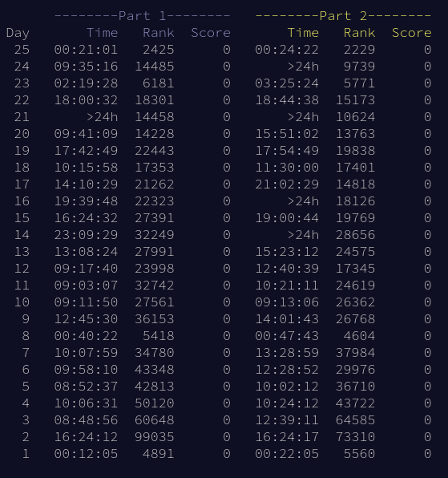

# Advent of Code 2024

A colleciton of some highs, lows, and buffalos from my advent of code 2024. There will be spoilers. {{ link/[See here|https://github.com/reshane/aoc2024/tree/main] }} for my solutions.

## Background

I first came across advent of code while watching Alexey Kutepov's youtube videos, specifically {{ link/[this series|https://www.youtube.com/playlist?list=PLpM-Dvs8t0VZNUvTX1pqfpI_tMkhWCLYL] }} where he solves all the problems while exploring templeOS and holy c (all hail king terry).
I would highly recommend watching along with his series from the previous year, where each day is completed using a different language.
I decided that this year I would be trying to complete all problems in rust, using only the standard library.
This is mostly because I had been writing a lot of rust in my free time up to this point, but also because I wanted to see if I could learn the standard library well enough to not depend on any crates.

## Highs

The first of my favorite moments from this year came on the very first day.
This is only a high because it was my first time discovering the ranking system and subsequently how slow I was, but nonetheless it was a high.
For the first day, I solved part 1 in 12 minutes and 5 seconds, and part 2 I completed at the 22 minute 5 second mark.
[my solution](https://github.com/reshane/aoc2024/blob/main/src/day1.rs) is 69 lines of code (nice), and took me so long to write not because I wasnt trying hard, but because December 1st 2024 was the end of a saturday night out for me.
The next high came on day 3 with the mul problem.
I solved part 2 by splitting the input on every `don't()`, and then for every resulting chunk except the first, apply my solution from part 1 to everything after the first `do()` of that chunk.
The first chunk being different because state starts off with the `mul`'s being enabled.
This just tickled something in my brain and felt very satisfying, and therefore it is a highlight.
Day 7 was another highlight, but only because I got to use one of my favorite tricks for part 1.
The trick is that to generate all possible sequences of two options for a given length, you can count from 0 to 2 to the power of the given length minus 1, and then use the binary representation at each increment to define a sequence.
For example, a sequence of Add and Mul of length 2 can be generated by counting from 0 to 3 in binary:
00 -> Add, Add
01 -> Add, Mul
10 -> Mul, Add
11 -> Mul, Mul
This is just a very satisfying relationship which holds true for any base, but it is easiest to define a mapping from index to sequence for base 2.
Day 15 was a highlight as well, for the same reason as day 3, but this one was much more satisfying.
Day 15 part 1 simply asks for the state of a warehouse after a robot has completed all of the instructions given as a list of directions (^v<>).
The robot can push boxes around, but not if there is a wall blocking any of the boxes the robot wants to move.
I implemented this as a state machine. In the step method of the Warehouse, I have this:
```
fn step(&mut self) {
    let dir = self.moves.remove(0);
    let dir_vec = match dir {
        Dir::Up => (0_i64, -1_i64),
        Dir::Down => (0_i64, 1_i64),
        Dir::Left => (-1_i64, 0_i64),
        Dir::Right => (1_i64, 0_i64),
    };

    let mut target = (self.robot.0 + dir_vec.0, self.robot.1 + dir_vec.1);
    let robot_next_pos = target.clone();
    let mut boxes_to_move = Vec::<Pos>::new();

    // update target until it is not in the boxes
    while self.boxes.contains(&target) {
        boxes_to_move.push(target);
        target.1 += dir_vec.1;
        target.0 += dir_vec.0;
    }

    if self.walls.contains(&target) {
        // there is a wall & we don't move
        return;
    }

    // the vector of boxes are a vertical line of boxes
    // we can just move the first encountered
    // to the empty position after last (aka target)
    if boxes_to_move.len() > 0 {
        self.boxes.remove(&robot_next_pos);
        self.boxes.insert(target);
    }
    self.robot = robot_next_pos;
}
```
And thats it.
First, the fact that the implementation works for every direction and only matches on the instruction once is very nice.
Second, and most satisfying, I only update the position of the first box, and the position of the robot.
This saves having to iterate over all of the boxes a second time after figuring out that they can actually be updated.
Unfortunately, this does not work for part 2, but this is still far and away the most satisfying bit of code that I wrote over the course of the month.
Day 17 is also worth mentioning because it was very cool to play around with the input and realize that there was a relationship between every 3 bits of the a register and each output.
I realized this a lot earlier than I was actually able to use it, but that is because I spent a lot of time trying to make powers of 8 work, rather than just shifting by 3.
Day 23 was fun because it is not often I get to use algorithms I learned in college, and I like doing it. Shoutout to Bron-Kerbosch and whoever has contributed to that wikipedia page.

## Lows

My lower moments are pretty obvious given my personal times:



Day 14 was tough because it took me a long time to realize that having every robot in a unique position would give the correct configuration, in fact I didn't realize this and it was a hint that I got from reddit.
In the end I was able to solve about 9 minutes after midnight which was disapointing.
Day 16 was a similar story. I was able to solve part 2 a little bit after midnight, but in this case it was because I started too late and it took me a long time to remember how to find all of the nodes I needed to.
Day 21 was unfortunate & was missed because I was extremely sick that day so I couldn't make it out of bed and over to the computer :(
Day 24 was really really tough. I was convinced until midnight of the 24th that I was going to be able to use a bfs / dfs approach where I swapped two and if that works, add that configuration to a queue or a stack or whatever.
I am still not 100% sure why that didn't work, but I know that I learned a lesson: I should not keep trying to algorithmically solve an analytical problem until it is too late.
I ended up doing it semi by hand just before the 25th day came out.

## Buffalos

When Day 25 opened up, I was almost done doing day 24 by hand, but I really wanted to try and get a good rank on the last day.
So I stashed everything for day 24 and started on day 25.
Then tragedy struck when I was able to solve day 25 part one pretty quickly, and then learned that I needed all the previous stars to finish the calendar.
I popped the stash, found made sure I had the pairs right, sorted them, printed, and submitted and was able to get the star.
Then I frantically clicked my way back over to day 25 and then delivered the chronical. That was crazy.
And I ended up getting my best scores so far on either part which was a great end to the calendar.
Day 5 was an interesting problem, I knew what a topological sort was, but had never actually written one.
I tried to sort everything by pushing each things children onto a stack, etc:
```
fn reorder(ord: &Vec<i64>, deps: &HashMap<i64, Vec<i64>>) -> Vec<i64> {
    // this sort implementation doesn't work for the problem :(
    // but does produce a vector sorted according to the topology
    let mut stack: Vec<i64> = vec![];
    for o in ord {
        // if ord contains a dependent of o
        // push the dependent onto the stack
        // if the stack already contains dep(o), dont push
        // then push o
        if let Some(o_dep) = deps.get(o) {
            let mut idx = o_dep.len();
            loop {
                idx -= 1;
                let d = o_dep[idx];
                if !stack.contains(&d) && ord.contains(&d) {
                    stack.push(d);
                }
                if idx == 0 {
                    break;
                }
            }
        }
        if !stack.contains(o) {
            stack.push(*o);
        }
    }
    stack
}
```

So I was pretty proud of this topo sort implementation, but because it didn't work for the problem, its in the buffalos :/
Overall, I had a lot of fun and the problems were great this year - despite the fact that I had to get hints on several occasions and was not able to solve every problem within 24 hours of it coming out.
I was able to solve every problem by the end of day 25, and was able to solve every problem with just the rust standard library.
Next year I'm thinking about trying to solve every day in Ocaml, but after a little bit of trying it out after solving day 25, I don't know that Ocaml will be the pick
