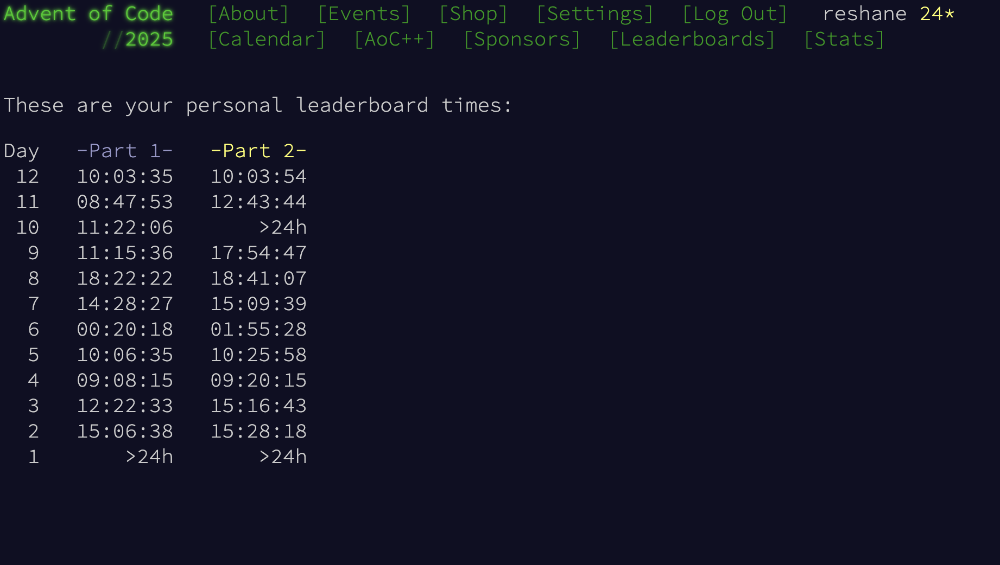

# Advent of Code 2025

This year was one of my favorite years of advent of code. I like that there was no global leaderboard anymore and much prefer only 12 days of problems.

Also - as is evident from my personal times, I was a little late to the party this year. On December 1st I had a migraine and was completely wiped for the entire day.
As a result I completely forgot that it was December, and was treated to two whole days of problems on December 2nd :)

One of my favorite problems this year also happened to be one of the hardest for me.
Part 2 of Day 10 was essentially a system of equations and a mininmization problem.
There are a set of buttons, each button increments a subset of the counters, what is the minimum button presses the result can be achieved with.

I have only ever taken one linear algebra class and three calculus classes, so I even though I knew within 10 minutes that this was a system of equations, I also knew I was going to be in trouble.
The solution used to generate the answer for my input was gaussian elimination, followed by recursively attempting solutions. This took a lot of studying other people's solutions and learning what the simplex algorithm is was probably my least favorite part of this year's AOC.
However, this was also the only problem this year for which I learned something entirely new.

As with most years it was a bit painful but definitely worth it. 

Some of my other favorite problems (the less painful ones include):
 - Day 9 - Realizing a valid rectangle would not contain perimeter tiles was a good moment.
 - Day 11 - paths(a -> b -> c) = paths(a -> b) * paths(b -> c) was fun.
 - Day 12 - I had been waiting for a problem that would require some analysis & I'm happy to say I didn't even try to fit any of the presents together.

I hope next year is more of the same in terms of the number of problems, leaderboard situation, and fun in general.

