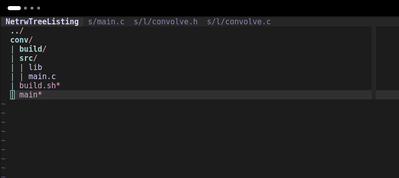
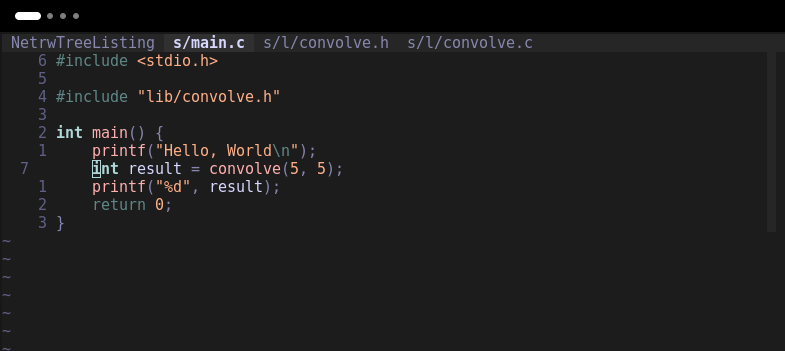
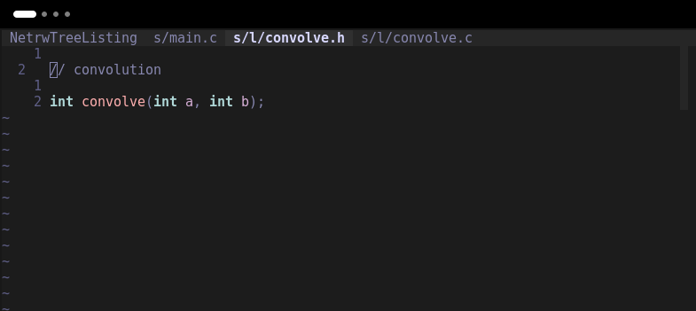
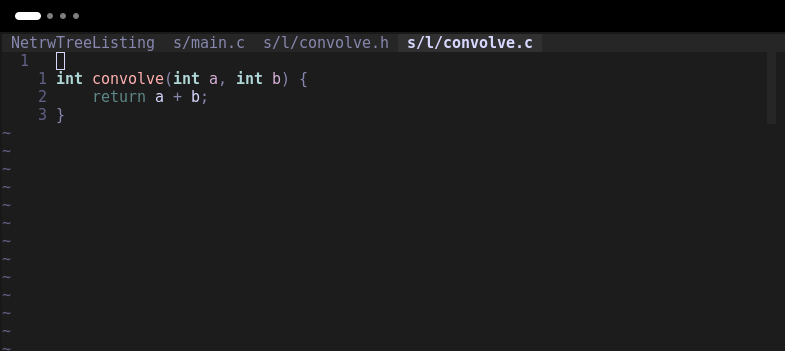
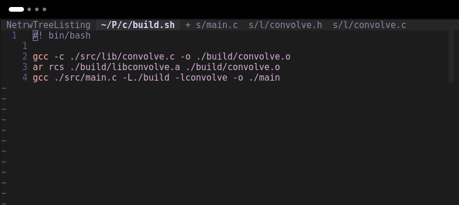
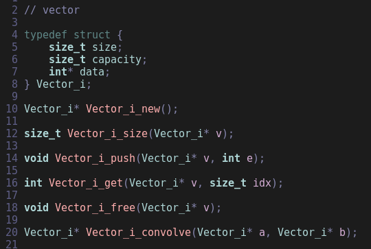
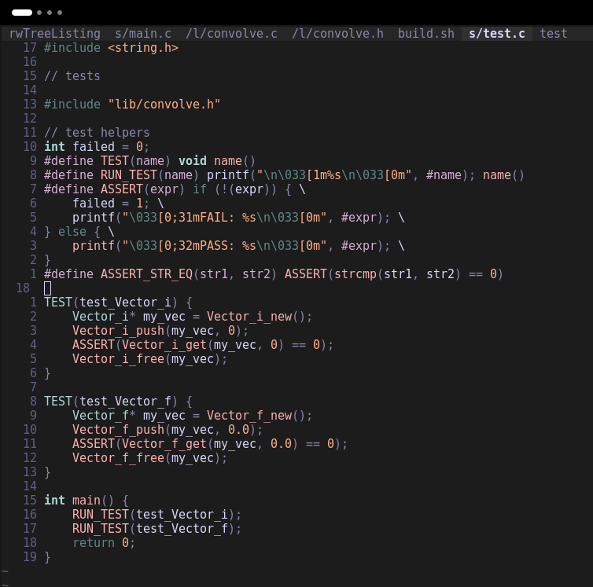
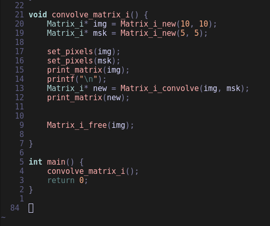
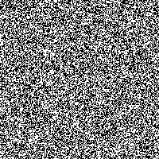
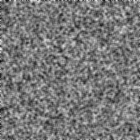

# Convolution

I want to do some convolution stuff in c because it seems fun.
So I start by making a project and taking some screenshots for this blog I guess.






Now to figure out how to build all of it...
[To stack overflow!](https://stackoverflow.com/questions/1705961/how-to-link-to-a-static-library-in-c)
And we end up with this:



Which allows us to do this: 

<video width="320" height="240" controls>
  <source src="./images/5_initial_run.webm" type="video/webm">
</video>

Great! Now let's warm up with some light convolution before starting the crazy stuff...
For that I'm going to write a data structure to help out a little



Admitedly, the naming of this thing is not great, but refactoring is a beautiful thing that I expect to do a lot of later.
For now, we can just start implementing this.
Most of it is pretty simple, malloc for our structure once and then malloc/realloc for our data once the capacity is exceeded...

```
// vector

Vector_i* Vector_i_new() {
    Vector_i* new = (Vector_i*) malloc(sizeof(Vector_i));
    if (!new) {
        printf("ERROR: Could initialize vector!");
        exit(1);
    }
    new->size = 0;
    new->capacity = 0;
    new->data = NULL;
    return new;
}

void Vector_i_push(Vector_i* v, int e) {
    if (v->capacity == 0) {
        v->capacity = 1;
        v->data = (int*) malloc(v->capacity * sizeof(int));
        if (!v->data) exit(1);
    }
    else if (v->size == v->capacity) {
        v->capacity *= 2;
        int* newMem = (int*) realloc(v->data, v->capacity * sizeof(int));
        if (!newMem) {
            // we have an error here... uh-oh!
            printf("ERROR: Could not increase the size of the vector");
            exit(1);
        }
        v->data = newMem;
    }
    v->data[v->size++] = e;
}

int Vector_i_get(Vector_i* v, size_t idx) {
    assert(idx < v->size);
    return v->data[idx];
}

size_t Vector_i_size(Vector_i* v) {
    return v->size;
}

size_t Vector_i_capacity(Vector_i* v) {
    return v->capacity;
}

void Vector_i_free(Vector_i* v) {
    free(v->data);
    free(v);
}
```

Also important to implement a free function so we aren't leaking a bunch of memory.
Even though what I'm going to be using this for will pretty much exclusivly be short-lived programs, just in case I ever use it for something longer, it'll be nice to have this function.
And best practices and all that stuff of course.
We can also write a test for it
Thanks to Kay Lack for the [little test framework](https://www.youtube.com/watch?v=5aZiRjgSGQU)



(ignore all that `Vector_f` stuff, that's for later and I forgot to remove it for the screenshot...)
Now for the `Vector_i_convolve` function...
I'll want to take in two vectors to perform the convolution over eachother, so we'll call them a and b
And basically what we'll be doing is something like this:

```
                           a[0, 1, 2, 3, 4, 5, 6, 7, 8, 9]
b[9, 8, 7, 6, 5, 4, 3, 2, 1, 0]
                        a[0, 1, 2, 3, 4, 5, 6, 7, 8, 9]
b[9, 8, 7, 6, 5, 4, 3, 2, 1, 0]
                     a[0, 1, 2, 3, 4, 5, 6, 7, 8, 9]
b[9, 8, 7, 6, 5, 4, 3, 2, 1, 0]
                  a[0, 1, 2, 3, 4, 5, 6, 7, 8, 9]
b[9, 8, 7, 6, 5, 4, 3, 2, 1, 0]
               a[0, 1, 2, 3, 4, 5, 6, 7, 8, 9]
b[9, 8, 7, 6, 5, 4, 3, 2, 1, 0]
            a[0, 1, 2, 3, 4, 5, 6, 7, 8, 9]
b[9, 8, 7, 6, 5, 4, 3, 2, 1, 0]
         a[0, 1, 2, 3, 4, 5, 6, 7, 8, 9]
b[9, 8, 7, 6, 5, 4, 3, 2, 1, 0]
      a[0, 1, 2, 3, 4, 5, 6, 7, 8, 9]
b[9, 8, 7, 6, 5, 4, 3, 2, 1, 0]
   a[0, 1, 2, 3, 4, 5, 6, 7, 8, 9]
b[9, 8, 7, 6, 5, 4, 3, 2, 1, 0]
a[0, 1, 2, 3, 4, 5, 6, 7, 8, 9]
b[9, 8, 7, 6, 5, 4, 3, 2, 1, 0]
a[0, 1, 2, 3, 4, 5, 6, 7, 8, 9]
   b[9, 8, 7, 6, 5, 4, 3, 2, 1, 0]
a[0, 1, 2, 3, 4, 5, 6, 7, 8, 9]
      b[9, 8, 7, 6, 5, 4, 3, 2, 1, 0]
a[0, 1, 2, 3, 4, 5, 6, 7, 8, 9]
         b[9, 8, 7, 6, 5, 4, 3, 2, 1, 0]
a[0, 1, 2, 3, 4, 5, 6, 7, 8, 9]
            b[9, 8, 7, 6, 5, 4, 3, 2, 1, 0]
a[0, 1, 2, 3, 4, 5, 6, 7, 8, 9]
               b[9, 8, 7, 6, 5, 4, 3, 2, 1, 0]
a[0, 1, 2, 3, 4, 5, 6, 7, 8, 9]
                  b[9, 8, 7, 6, 5, 4, 3, 2, 1, 0]
a[0, 1, 2, 3, 4, 5, 6, 7, 8, 9]
                     b[9, 8, 7, 6, 5, 4, 3, 2, 1, 0]
a[0, 1, 2, 3, 4, 5, 6, 7, 8, 9]
                        b[9, 8, 7, 6, 5, 4, 3, 2, 1, 0]
a[0, 1, 2, 3, 4, 5, 6, 7, 8, 9]
                           b[9, 8, 7, 6, 5, 4, 3, 2, 1, 0]
```

where we can imagine flipping b around so that its lowest indices are on the right,
and its 0th index is placed under the 0th index of a
we can then multuply the elements that are 'facing eachother', and shift b to the right
Now, dealing with the pairs of operations should look something like this

```
a[0] * b[0]
a[0] * b[1] + a[1] * b[0]
a[0] * b[2] + a[1] * b[1] + a[2] * b[0]
...
a[1] * b[9] + a[2] * b[8] * a[3] * b[7] ... 
a[2] * b[9] + a[3] * b[8] * a[4] * b[7] ... 
```

And after lots of thought and effort, we can write this function:

```
Vector_i* Vector_i_convolve(Vector_i* a, Vector_i* b) {
    Vector_i* result = Vector_i_new();

    int a_size = Vector_i_size(a);
    int b_size = Vector_i_size(b);

    int a_start = 0, b_start = 0;
    for (int i=0; i<a_size+b_size; ++i) {
        int j=a_start,k=b_start,total=0;
        while (j<a_size && k>-1) {
            total += Vector_i_get(a, j) * Vector_i_get(b, k);
            j++;
            k--;
        }
        Vector_i_push(result, total);
        if (b_start == b_size-1) {
            a_start++;
        } else {
            b_start++;
        }
    }

    return result;
}
```

and then we can try it out in our main:
(Note that I have DEBUG in a `#define` statement above main to turn the printing on/off

```
int main() {
    Vector_i* base = Vector_i_new();
    Vector_i* mask = Vector_i_new();

    for (int i = 0; i < SIZE; ++i) {
        Vector_i_push(base, i);
        if (DEBUG) printf("vector contents\n\tsize: %d\n\tcap: %d\n\tlast: %d\n", base->size, base->capacity, base->data[base->size-1]);
        Vector_i_push(mask, i);
        if (DEBUG) printf("vector contents\n\tsize: %d\n\tcap: %d\n\tlast: %d\n", mask->size, mask->capacity, mask->data[mask->size-1]);
    }

    if (DEBUG) printf("vector contents\n\tsize: %d\n\tcap: %d\n\tlast: %d\n", base->size, base->capacity, base->data[base->size-1]);
    if (DEBUG) printf("vector contents\n\tsize: %d\n\tcap: %d\n\tlast: %d\n", mask->size, mask->capacity, mask->data[mask->size-1]);

    Vector_i* result = Vector_i_convolve(base, mask);

    if (1) {
        printf("[");
        for (int i = 0; i < Vector_i_size(result); ++i) {
            printf("%d", Vector_i_get(result, i));
            if (i+1 != Vector_i_size(result)) printf(",");
        }
        printf("]");
    }

    Vector_i_free(base);
    Vector_i_free(mask);
    Vector_i_free(result);

    return 0;
}
```

And with `DEBUG = 0`, when we `./build.sh && ./build/main`


Great! Thats probably right... 
Lets start in the convolve.h file by defining our interface:

```
// matrix

typedef struct {
    size_t rows;
    size_t cols;
    int* data;
} Matrix_i;

Matrix_i* Matrix_i_new(size_t rows, size_t cols);

size_t Matrix_i_rows(Matrix_i* m);

size_t Matrix_i_cols(Matrix_i* m);

void Matrix_i_set(Matrix_i* m, size_t x, size_t y, int e);

int Matrix_i_get(Matrix_i* m, size_t x, size_t y);

void Matrix_i_free(Matrix_i* m);

Matrix_i* Matrix_i_convolve(Matrix_i* a, Matrix_i* b);
```

Now we can implement our functions, pretty much the same way we did for our `Vector_i`, which I will skip for brevity
So once we have all our helper functions we can start convolving matrices.
This is going to be a lot simpler than the vector convolution because for the vector we did a biblically accurate convolution - where it is mathematically correct.
For the matrix, we are essentially going to do the dumbed-down computer science version & just take a moving weighted sum of each element.
I am also going to ignore all of the little edges and essentially treat the middle of our matrix b as the sole point of focus.
And calculate an output for each element of a with b positioned such that its center is paired with the element of a in question.
So, for example - If we were doing a biblically accurate matrix convolution, we would have to deal with cases like this:

```
 _________
|         |
|         |
|    b    |
|        _|_______
|_______|_|       |
        |         |
        |    a    |
        |         |
        |_________|
```

In the case where we are convolving b over a, above is the visual representation of the first step
where the overlap represents elements of each matrix that are 'paired up' for this iteration,
and therefore should be multiplied pair-wise and then summed to produce the output.
If we were to do this, the resulting matrix would be larger than a...
How much larger? I'm not sure but we can figure that out now (since I don't feel like writing the function right now)
So we start with the matrices positioned as above.
We perform an operation, shift, and repeat until we find a and b in the following configuration

```
         _________
        |         |
        |         |
        |    b    |
        |_________|
        |_________|
        |         |
        |    a    |
        |         |
        |_________|
```

In the case above b and a have the same width, but regardless of relative widths, we will have done `Matrix_i_cols(a)` operations and therefore have generated as many outputs.
Then, we continue until just a single element of each is overlapping, like this

```
                 _________
                |         |
                |         |
                |    b    |
         _______|_        |
        |       |_|_______|
        |         |
        |    a    |
        |         |
        |_________|
```

So we've now done an additional `Matrix_i_cols(b) - 1` operations, and thus have generated as many outputs
Which puts us at `Matrix_i_cols(a) + Matrix_i_cols(b) - 1` 
Flipping the whole thing on it's side we can see that the same holds true for the height
And so the biblically accurate output matrix has the following dimensions:
width: `Matrix_i_cols(a) + Matrix_i_cols(b) - 1`
height: `Matrix_i_rows(a) + Matrix_i_rows(b) - 1`
Anyway, now lets write the blasphemers version
For each element in a, we apply b as if its center is at the current element of a.
Applying b involves pairing each element with an element from a by its relative position.

```
Matrix_i* Matrix_i_convolve(Matrix_i* a, Matrix_i* b) {
    size_t a_w = Matrix_i_cols(a);
    size_t a_h = Matrix_i_rows(a);

    size_t b_w = Matrix_i_cols(b);
    size_t b_h = Matrix_i_rows(b);

    Matrix_i* result = Matrix_i_new(a_w, a_h);

    for (size_t y=0; y<a_h; ++y) {
        for (size_t x=0; x<a_w; ++x) {
            uint8_t bytes[4] = {0, 0, 0, 0};
            int weighted_sum = 0;
            for (size_t i=0; i<b_h; ++i) {
                for (size_t j=0; j<b_w; ++j) {
                    int c = Matrix_i_get(b,i,j);
                    int a_x = ((x+j)-(b_w/2));
                    int a_y = ((y+i)-(b_h/2));

                    if ((a_x>-1) && (a_x<a_w) && (a_y>-1) && (a_y<a_h)) {
                        weighted_sum += Matrix_i_get(a,a_x,a_y) * c;
                    }
                }
            }
            Matrix_i_set(result,y,x, weighted_sum);
        }
    }
    return result;
}
```

Here, we are calculating the index into a by adding the current index of a and b & subtracting half of the corresponding dimension of b.
Now we can see if this thing is working...



<video width="320" height="240" controls>
  <source src="./images/10_matrix_output_initial.webm" type="video/webm">
</video>

This doesn't really do anything for us though, what is the application for a discreet finite convolution of two integer matrices?
I'm sure someone smarter than me could find a use... but I'm not smarter than me yet
But what we can do is create new matrix types for unsigned 32-bit integers & floats, then convolve the floats over the ints
We can then encode image data in the `uint32_t` matrix and applying the convolution will change the image
So lets write that function:

```
// cross-type convolution
Matrix_u32* Matrix_u32_f_convolve(Matrix_u32* a, Matrix_f* b) {
    size_t a_w = Matrix_u32_cols(a);
    size_t a_h = Matrix_u32_rows(a);

    size_t b_w = Matrix_f_cols(b);
    size_t b_h = Matrix_f_rows(b);

    Matrix_u32* result = Matrix_u32_new(a_w, a_h);

    for (size_t y=0; y<a_h; ++y) {
        for (size_t x=0; x<a_w; ++x) {
            uint32_t weighted_sum = 0;
            for (size_t i=0; i<b_h; ++i) {
                for (size_t j=0; j<b_w; ++j) {
                    float c = Matrix_f_get(b,i,j);
                    int a_x = ((x+j)-(b_w/2));
                    int a_y = ((y+i)-(b_h/2));

                    uint32_t pixel = Matrix_u32_get(a,x,y);
                    if ((a_x>-1) && (a_x<a_w) && (a_y>-1) && (a_y<a_h)) {
                        pixel = Matrix_u32_get(a,a_x,a_y);
                    }
                    // apply the mask to get the correct bytes
                    // shift them over to the right, multuply by the coefficient
                    // shift them back to where the were and add to the sum
                    weighted_sum += ((uint8_t)(((pixel&0x0000FF)>>8*0) * c))<<8*0;
                    weighted_sum += ((uint8_t)(((pixel&0x00FF00)>>8*1) * c))<<8*1;
                    weighted_sum += ((uint8_t)(((pixel&0xFF0000)>>8*2) * c))<<8*2;
                }
            }
            Matrix_u32_set(result,y,x, weighted_sum);
        }
    }
    return result;
}
```

now this compiles, and we can use it in our main function...

```
int main() {
    Matrix_u32* img = Matrix_u32_new(400, 400);
    Matrix_f* msk = Matrix_f_new(4, 4);
    tv_static(img);
    flat_blur_matrix(msk);
    save_img_as_ppm(img, "original.ppm");
    Matrix_u32* blr = Matrix_u32_f_convolve(img, msk);
    save_img_as_ppm(blr, "blurred.ppm");
    return 0;
}
```

The first thing we do above is create a 400x400 matrix to represent out image.
Then, we create a 4x4 mask that will be the box which we move over our image to blur it.
Then we fill the image with either black or white pixels by passing its pointer to the `tv_static` function, which looks like this:

```
void tv_static(Matrix_u32* img) {
    size_t w = Matrix_u32_cols(img);
    size_t h = Matrix_u32_rows(img);

    for (int y=0; y<h; ++y) {
        for (int x=0; x<w; ++x) {
            uint32_t pixel = 0xFF000000;
            if ((int)((rand()/(float)RAND_MAX) + 0.5)) {
                pixel = 0xFFFFFF;
            }
            Matrix_u32_set(img,x,y,pixel);
        }
    }
}
```

Then we can fill up our msk matrix with values that sum to 1.0f with a function like this:

```
void flat_blur_matrix(Matrix_f* msk) {
    size_t msk_w = Matrix_f_cols(msk);
    size_t msk_h = Matrix_f_rows(msk);
    for (int y=0; y<msk_h; ++y) {
        for (int x=0; x<msk_w; ++x) {
            Matrix_f_set(msk,y,x,1.0/(msk_w*msk_h));
        }
    }
}
```

Then, I use this `save_image_as_ppm` to output the data into an image file with the given name, PPM being the choice of format because it's header is extremely simple:

```
P6
WIDTH HEIGHT 255
RGB_IMAGE_BYTES
```
And this is the function used to generate that file:
```
void save_img_as_ppm(Matrix_u32* img, const char *file_path) {
    FILE* f = fopen(file_path, "wb");
    if (f == NULL) {
        fprintf(stderr, "ERROR: could not write into file %s: %s\n", file_path, strerror(errno));
        exit(1);
    }
    size_t img_w = Matrix_u32_cols(img);
    size_t img_h = Matrix_u32_rows(img);
    fprintf(f, "P6\n%d %d 255\n", img_w, img_h);
    for (size_t y=0; y<img_h; ++y) {
        for (size_t x=0; x<img_w; ++x) {
            uint32_t pixel = Matrix_u32_get(img,x,y);
            uint8_t bytes[3] = {
                (pixel&0x0000FF)>>8*0,
                (pixel&0x00FF00)>>8*1,
                (pixel&0xFF0000)>>8*2
            };
            fwrite(bytes, sizeof(bytes), 1, f);
            assert(!ferror(f));
        }
    }
    fclose(f);
}
```
Then we apply our blur to the matrix, generating a new image data matrix, and call the same function on it to save it as a PPM image file.
And just like that, we have our original.ppm:



And our blurred.ppm image:



