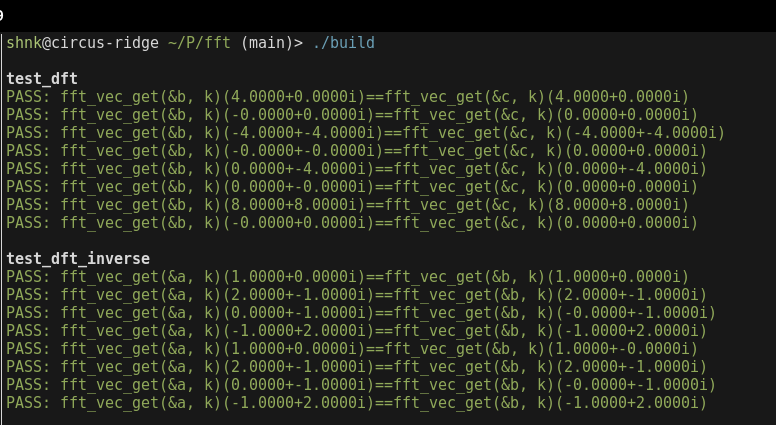
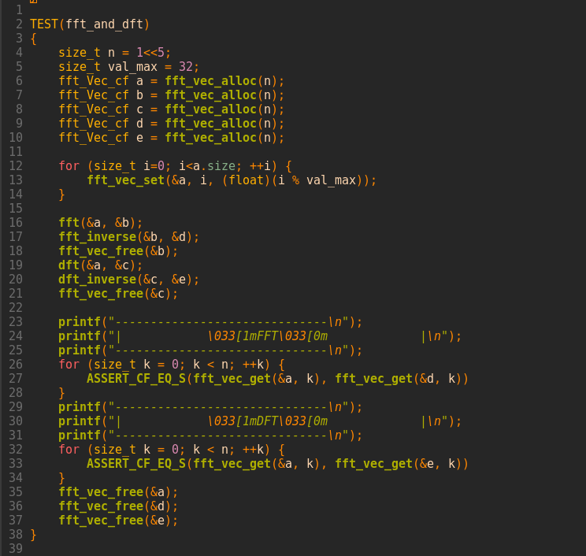
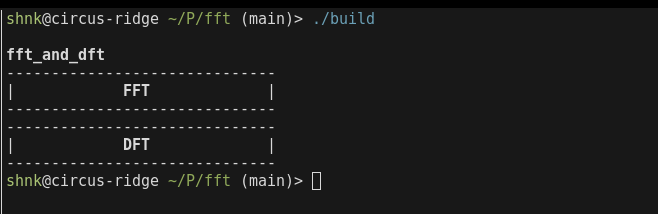
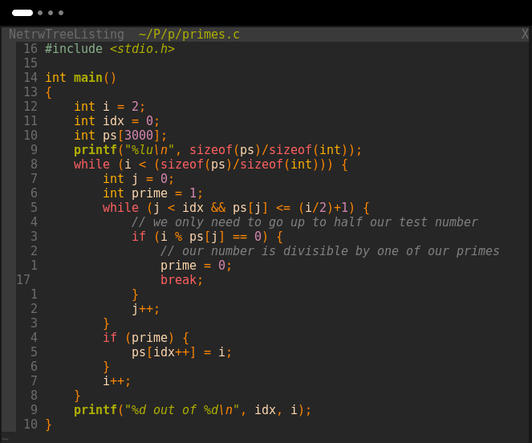

# Fourier Transforms

As I am someone who enjoys interesting algorithms, math, and re-implementing existing things, it was only a matter of time before I wrote a fourier transform.

The first time I had the idea to do so was in college when I saw [this 3b1b video](https://www.youtube.com/watch?v=KuXjwB4LzSA) so thats where we'll start

This time around I wanted to implement the algorithm within an stb-style header only library, so we'll start with some data structures to support our algorithm there...

```
#ifndef FFT_H_
#define FFT_H_

// == INCLUDES ==

#include <stdio.h>
#include <math.h>
#include <complex.h>

#ifndef FFT_NO_UNI_STD
#include <unistd.h>
#endif // FFT_NO_UNI_STD

#ifndef FFT_MALLOC
#include <stdlib.h>
#define FFT_ALLOC malloc
#define FFT_FREE free
#endif // FFT_MALLOC

#ifndef FFT_ASSERT
#include <assert.h>
#define FFT_ASSERT assert
#endif // FFT_ASSERT


// == DEFINITIONS ==

// [[ CONSTANTS ]]

#define FFT_EPSILON 0.00001f

// [[ STRUCTURES ]]

// -- Vector --

typedef struct {
    size_t size;
    float complex* data;
} fft_Vec_cf;
fft_Vec_cf fft_vec_alloc(size_t cap);
void fft_vec_free(fft_Vec_cf* v);
// deprecated
float complex* fft_vec_at(fft_Vec_cf* v, size_t i);
float complex fft_vec_get(fft_Vec_cf* v, size_t i);
void fft_vec_set(fft_Vec_cf* v, size_t i, float complex e);

// -- Matrix --
typedef struct {
    size_t rows;
    size_t cols;
    float complex* data;
} fft_Matrix_cf;
fft_Matrix_cf fft_mat_alloc(size_t rows, size_t cols);
void fft_mat_free(fft_Matrix_cf* mat);
float complex fft_mat_get(fft_Matrix_cf* mat, size_t x, size_t y);
void fft_mat_set(fft_Matrix_cf* mat, size_t x, size_t y, float complex e);
```

Along with all of our includes (some made optional by putting their functions behind macros which I thought was a cool way to provide configuration to users of the library),

We define vector and matrix data structures along with some associated functions

Also defined in our `[[ CONSTANTS ]]` section is an epsilon value, which will come in handy later for floating-point stuff...

Now we can move on to the implementation of the boilerplate for our data structures

```
#ifdef FFT_IMPLEMENTATION

// == IMPLEMENTATION ==

// [[ STRUCTURES ]]

// -- Vector --

fft_Vec_cf fft_vec_alloc(size_t cap)
{
    fft_Vec_cf v;

    v.size = cap;
    v.data = FFT_ALLOC(v.size*sizeof(*v.data));
    FFT_ASSERT(v.data);

    return v;
}

void fft_vec_free(fft_Vec_cf* v)
{
    FFT_FREE(v->data);
}

float complex* fft_vec_at(fft_Vec_cf* v, size_t i)
{
    FFT_ASSERT(i < v->size);
    return &v->data[i];
}

float complex fft_vec_get(fft_Vec_cf* v, size_t i)
{
    return *fft_vec_at(v, i);
}

void fft_vec_set(fft_Vec_cf* v, size_t i, float complex e)
{
    FFT_ASSERT(i < v->size);
    *fft_vec_at(v, i) = e;
}

// -- Matrix --

fft_Matrix_cf fft_mat_alloc(size_t rows, size_t cols)
{
    fft_Matrix_cf mat;
    mat.rows = rows;
    mat.cols = cols;
    mat.data = (float complex*)malloc(sizeof(float complex)*rows*cols);
    FFT_ASSERT(mat.data);
    return mat;
}

void fft_mat_free(fft_Matrix_cf* mat)
{
    free(mat->data);
}

float complex fft_mat_get(fft_Matrix_cf* mat, size_t x, size_t y)
{
    size_t idx = y*mat->cols + x;
    FFT_ASSERT(idx<(mat->cols)*(mat->rows));
    return mat->data[idx];
}

void fft_mat_set(fft_Matrix_cf* mat, size_t x, size_t y, float complex e)
{
    size_t idx = y*mat->cols + x;
    FFT_ASSERT(idx<(mat->cols)*(mat->rows));
    mat->data[idx] = e;
}
```

Great! now we have data structures we can use to create some memory leaks

or not that - let's implement a discrete fourier tranform using our vector to get a grip on what we're actually doing

```
// [[ ALGORITHMS ]]

void dft(fft_Vec_cf* series, fft_Vec_cf* dft_series);
void dft_inverse(fft_Vec_cf* dft_series, fft_Vec_cf* series);
...

// -- Discrete Fourier Transform -- 

void dft(fft_Vec_cf* series, fft_Vec_cf* dft_series)
{
    for (size_t i=0; i<dft_series->size; ++i) {
        float complex res = 0.f;
        for (size_t j=0; j<series->size; ++j) {
            float complex xn = fft_vec_get(series, j);
            res += xn * cexp((-2.f*I*M_PI*(float)j*(float)i)/(float)dft_series->size);
        }
        fft_vec_set(dft_series, i, res);
    }
}

void dft_inverse(fft_Vec_cf* dft_series, fft_Vec_cf* series)
{
    for (size_t i=0; i<series->size; ++i) {
        float complex res = 0.f;
        for (size_t j=0; j<dft_series->size; ++j) {
            float complex xn = fft_vec_get(dft_series, j);
            res += xn * cexp((2.f*I*M_PI*(float)j*(float)i)/(float)series->size);
        }
        res /= series->size;
        fft_vec_set(series, i, res);
    }
}
```

Cool - now we have a pretty good idea what we're doing

Basically calculating the center of mass of our function when wrapped around the origin for a given frequency, which maps to the index in our resulting vector

And for computing the inverse, we go the opposite way by using omega^-1 - aka the root of unity that we are evaluating at to the -1 power.

Now we can write some tests to make sure we did everything right

```
TEST(test_dft)
{
    size_t n = 8;
    fft_Vec_cf a = fft_vec_alloc(n);
    fft_Vec_cf b = fft_vec_alloc(n);
    fft_Vec_cf c = fft_vec_alloc(n);

    fft_vec_set(&a, 0,  1.f +  0.f * I);
    fft_vec_set(&a, 1,  2.f + -1.f * I);
    fft_vec_set(&a, 2,  0.f + -1.f * I);
    fft_vec_set(&a, 3, -1.f +  2.f * I);
    fft_vec_set(&a, 4,  1.f +  0.f * I);
    fft_vec_set(&a, 5,  2.f + -1.f * I);
    fft_vec_set(&a, 6,  0.f + -1.f * I);
    fft_vec_set(&a, 7, -1.f +  2.f * I);


    fft_vec_set(&c, 0,  4.f +  0.f * I);
    fft_vec_set(&c, 1,  0.f +  0.f * I);
    fft_vec_set(&c, 2, -4.f + -4.f * I);
    fft_vec_set(&c, 3,  0.f +  0.f * I);
    fft_vec_set(&c, 4,  0.f + -4.f * I);
    fft_vec_set(&c, 5,  0.f +  0.f * I);
    fft_vec_set(&c, 6,  8.f +  8.f * I);
    fft_vec_set(&c, 7,  0.f +  0.f * I);

    dft(&a, &b);
    fft_vec_free(&a);

    for (size_t k = 0; k < n; ++k) {
        ASSERT_CF_EQ(fft_vec_get(&b, k), fft_vec_get(&c, k))
    }

    fft_vec_free(&b);
    fft_vec_free(&c);
}

TEST(test_dft_inverse)
{
    size_t n = 8;
    fft_Vec_cf a = fft_vec_alloc(n);
    fft_Vec_cf b = fft_vec_alloc(n);
    fft_Vec_cf c = fft_vec_alloc(n);

    fft_vec_set(&a, 0,  1.f +  0.f * I);
    fft_vec_set(&a, 1,  2.f + -1.f * I);
    fft_vec_set(&a, 2,  0.f + -1.f * I);
    fft_vec_set(&a, 3, -1.f +  2.f * I);
    fft_vec_set(&a, 4,  1.f +  0.f * I);
    fft_vec_set(&a, 5,  2.f + -1.f * I);
    fft_vec_set(&a, 6,  0.f + -1.f * I);
    fft_vec_set(&a, 7, -1.f +  2.f * I);


    fft_vec_set(&c, 0,  4.f +  0.f * I);
    fft_vec_set(&c, 1,  0.f +  0.f * I);
    fft_vec_set(&c, 2, -4.f + -4.f * I);
    fft_vec_set(&c, 3,  0.f +  0.f * I);
    fft_vec_set(&c, 4,  0.f + -4.f * I);
    fft_vec_set(&c, 5,  0.f +  0.f * I);
    fft_vec_set(&c, 6,  8.f +  8.f * I);
    fft_vec_set(&c, 7,  0.f +  0.f * I);

    dft_inverse(&c, &b);
    fft_vec_free(&c);

    for (size_t k = 0; k < n; ++k) {
        ASSERT_CF_EQ(fft_vec_get(&a, k), fft_vec_get(&b, k))
    }
    fft_vec_free(&a);
    fft_vec_free(&b);
}
```

Awesome - lets see if that works...



Now lets implement the the Fast Fourier Transform and see how much faster it is compared to the naive discrete approach..

Looking at [this wikipedia page](https://en.wikipedia.org/wiki/Butterfly_diagram) really clears up what I found to be the complicated part of implementing the algorithm

Essentially what it is doing to recombine the recursively solved sub-problems is two expressions on each pair, which generate elements at their respective indices:

```
y0 = x0 + x1*w
y1 = x0 - x1*w
```

where `x0` and `x1` are elements of the same index in the transformed sub problems, in this case `x0` comes from the even index sub-problem.

`w` in the above is our omega value, which is essentially just a root of unity - there is a lot more that goes into why these twiddle factors do what they do, but the jist is that evaluating polynomials at inputs selected such that they cancel eachother out drastically reduces the number of operations that must be performed, and these specific complex numbers allow us to do that :-)

With all that knowledge, we are ready to implement our recursive-cooley-tukey fast fourier transform...

```
double complex fft_omega(size_t n, size_t k)
{
    return cexp((-2.f*I*M_PI*k)/n);
}

void fft(fft_Vec_cf* series, fft_Vec_cf* dft_series)
{
    FFT_ASSERT(series->size == dft_series->size);
    if (series->size == 1) {
        fft_vec_set(dft_series, 0, fft_vec_get(series, 0));
        return;
    }
    size_t series_count = series->size;
    FFT_ASSERT(series_count % 2 == 0);

    // split the series into even and off
    fft_Vec_cf evn = fft_vec_alloc(series_count/2);
    fft_Vec_cf odd = fft_vec_alloc(series_count/2);
    for (size_t k = 0; k < series_count/2; ++k) {
        fft_vec_set(&evn, k, fft_vec_get(series, k*2));
        fft_vec_set(&odd, k, fft_vec_get(series, (k*2)+1));
    }

    // get dft of each part
    fft_Vec_cf evn_dft = fft_vec_alloc(series_count/2);
    fft_Vec_cf odd_dft = fft_vec_alloc(series_count/2);

    fft(&evn, &evn_dft);
    fft(&odd, &odd_dft);

    fft_vec_free(&evn);
    fft_vec_free(&odd);

    // butterfly them together
    for (size_t k = 0; k < series_count/2; ++k) {
        double complex w = fft_omega(series_count, k);
        double complex x0 = fft_vec_get(&evn_dft, k);
        double complex x1 = fft_vec_get(&odd_dft, k);

        double complex y0 = x0 + x1*w;
        double complex y1 = x0 - x1*w;

        fft_vec_set(dft_series, k, y0);
        fft_vec_set(dft_series, k+series_count/2, y1);
    }

    fft_vec_free(&evn_dft);
    fft_vec_free(&odd_dft);
}
```

Pro tip: In debugging and fixing my implementation I found that it was easier to start with a pseudo-recursive implementation, where the recursive calls above to `fft` are first calls to what we know to be a working `dft`.

Then we can write some more tests to see if this thing actually works: 




You might notice I am calling an fft_inverse function in the tests, this is pretty much the same exact algorithm, but but with a slight difference in the butterfly recombination:

```
double complex w = cexp((2.f*I*M_PI*(int)k)/series_count);
double complex x0 = fft_vec_get(&evn_dft, k);
double complex x1 = fft_vec_get(&odd_dft, k);

double complex y0 = 0.5f*(x0 + x1*w);
double complex y1 = 0.5f*(x0 - x1*w);
```

Now we can explore the differences in speed of our two algorithms

We can do so by splitting the test we wrote into two sections that we will turn on and off with a macro definition, and timing each one while increasing the input (shifting `n` until one runs too slow)

<video width="320" height="240" controls>
  <source src="./images/3_dft_vs_fft.webm" type="video/webm">
</video>

The difference only gets more noticeable as n grows, but on only n = 4096, a difference of over two seconds to about 500 milliseconds is significant

It is worth noting at this point that this implementation can be improved - for example by performing it in place rather than mking a recursive call at all

Additionally, the original Cooley-Tukey algorithm, which is what we've implemented, is limited by the fact that it can only work on inputs that are a power of two in size

This can also be improved by using what is called a mixed radix

Above we split into two sub problems, but we could have also chosen to split into 3, 5, 7, 11 or some other number of groups. Importantly, this choice can be made on sub problems independent of other sub problems or parent problems, meaning it is possible to dynamically split the input based on its prime factorization.

For the theoretical, general purpose uber algorithm, the keen eyed will observe that for increasingly large prime inputs, writing more radixes for the mixed radix solution is a losing battle - i.e. there will always be a larger prime input that the algorithm will not be able to handle. For this case, we have the dft - although very slow, it will solve the problem on prime inputs.

How is this dealt with in the real world though? Well, I would choose an implementation based on domain. For example, if this is going to be used for image processing, it could accept images up to certain dimensions and then implement radixes for all primes up to that number - sounds like a lot of work, but primes get more sparse the higher you go, so how many could it really be?

As an aside, we can find out...

I haven't seen too many images larger than 3000x3000 - of course there are images that need to be much much larger than this, but for the sake of argument...

we can write a program to find some primes like this...



The temptation to start i at 0 or 1 is extremely strong, but it is important to remember that neither are prime - 1 only has one factor, and 0 has infinite factors, so although they are special little guys, this isn't about them

We start at 2 and test whether our previously found primes divide evenly into our current potential prime - something we only have to do up until it is half of our test number (because past that point we are testing what would be factors that would be multiplied by factors we already tested to produce the result - thus a redundant test).

Additionally, we can break out of the loop when we find a factor, since we only need one factor besides 1 and i to prove i is not prime

And that is how we get our 27 lines of glorious prime finding action, now to run it...

<video width="320" height="240" controls>
  <source src="./images/5_primes_run.webm" type="video/webm">
</video>

And Melissa wants me to do 10_000, so here we go...

<video width="320" height="240" controls>
  <source src="./images/6_stinky_request_primes_run.webm" type="video/webm">
</video>

So if we want to accept images up to 10_000x10_000, we have to implement 1_229 radixes... Not a super realistic solution, so how does one generate these implementations? There must be a pattern that can be exploited, but for now I'm going to move on to a 2 dimensional implementation without writing any other radixes (to keep things simple for myself).

Looking at a bunch of different things, including [this pdf](https://www.robots.ox.ac.uk/~az/lectures/ia/lect2.pdf) and [this video](https://www.youtube.com/watch?v=v743U7gvLq0)

it seems that a fourier transform in two dimensions can be performed via transforming all the rows individually as if they were independent 1 dimensional transforms

and then repeating the process on the columns formed by the transformed rows

Before implementing this algorithm on the  Matrix data type, I'll first do a slow version where I translate the matrices to arrays of our vector type and just call our vector functions on the row and column vectors...

```
void fft_matrix(fft_Matrix_cf* mat)
{
    size_t img_rows = mat->rows;
    size_t img_cols = mat->cols;
    fft_Vec_cf rows[img_rows];
    fft_Vec_cf dft_rows[img_rows];
    fft_Vec_cf cols[img_cols];
    fft_Vec_cf dft_cols[img_cols];

    // put the matrix rows in the rows array of vectors
    for (size_t k = 0; k < img_rows; ++k) {
        rows[k] = fft_vec_alloc(img_cols);
        for (size_t j = 0; j < img_cols; ++j) {
            fft_vec_set(&rows[k], j, fft_mat_get(mat, k, j));
        }
    }

    // perform an fft on each row
    for (size_t k = 0; k < img_rows; ++k) {
        dft_rows[k] = fft_vec_alloc(img_cols);
        fft(&rows[k], &dft_rows[k]);
        fft_vec_free(&rows[k]);
    }

    for (size_t k = 0; k < mat->rows; ++k) {
        for (size_t j = 0; j < mat->cols; ++j) {
            // double complex f = fft_vec_get(&dft_rows[k], j);
            // printf("%f+%fi ", creal(f), cimag(f));
        }
        // printf("\n");
    }

    // copy the rows over to the cols array of vectors
    for (size_t j = 0; j < img_cols; j++) {
        cols[j] = fft_vec_alloc(img_rows);
        for (size_t k = 0; k < img_rows; ++k) {
            fft_vec_set(&cols[j], k, fft_vec_get(&dft_rows[k], j));
        }
    }

    // free all the dft_rows vectors
    for (size_t k = 0; k < img_rows; ++k) {
        fft_vec_free(&dft_rows[k]);
    }

    // perform an fft on each column 
    for (size_t k = 0; k < img_cols; ++k) {
        dft_cols[k] = fft_vec_alloc(img_rows);
        fft(&cols[k], &dft_cols[k]);
        fft_vec_free(&cols[k]);
    }

    // copy the cols back into the matrix
    for (size_t k = 0; k < img_cols; ++k) {
        for (size_t j = 0; j < img_rows; ++j) {
            fft_mat_set(mat, j, k, fft_vec_get(&dft_cols[k], j));
        }
        fft_vec_free(&dft_cols[k]);
    }
}
```

And of course the inverse transform I'm doing the same thing but first the columns and calling fft_inverse on everything instead

Now we can get into transforming some images!

We'll do this with the help of the PPM format and some arrays of `uint32_t`'s:

```
size_t img_rows = 512, img_cols = 512;
uint32_t* img = (uint32_t*)malloc(img_rows*img_cols*sizeof(uint32_t));

...

void save_img_as_ppm(uint32_t* img, size_t rows, size_t cols, const char *file_path)
{
    FILE* f = fopen(file_path, "wb");
    if (f == NULL) {
        fprintf(stderr, "ERROR: could not write into file %s", file_path);//: %s\n", file_path, strerror(errno));
        exit(1);
    }
    size_t img_w = cols;
    size_t img_h = rows;
    fprintf(f, "P6\n%ld %ld 255\n", img_w, img_h);
    for (size_t y=0; y<img_h; ++y) {
        for (size_t x=0; x<img_w; ++x) {
            uint32_t pixel = img[x+y*cols];
            uint8_t bytes[3] = {
                (pixel&0x0000FF)>>8*0,// R
                (pixel&0x00FF00)>>8*1,// G
                (pixel&0xFF0000)>>8*2 // B
            };
            fwrite(bytes, sizeof(bytes), 1, f);
            assert(!ferror(f));
        }
    }
    fclose(f);
}
```

Now the world is kind of our oyster in terms of generating interesting looking things, but to try and keep things understandable, I'm going to be trying to keep everythign grayscale & keeping our values from 0-256 with these functions:

```
// multiply by 255 and put the vale in each channel
uint32_t get_color(double complex f) {
    double re = creal(f);
    double im = cimag(f);
    double mag = sqrt(re*re+im*im);
    uint32_t res = 0x00000;
    uint32_t coef = 0xFF;
    res = res | (((uint32_t)(mag*coef)&0xFF)<<8*0);
    res = res | (((uint32_t)(mag*coef)&0xFF)<<8*1);
    res = res | (((uint32_t)(mag*coef)&0xFF)<<8*2);
    return res;
}

// grab the end (which should be repeated for each channel) and normalize 0-1
double complex map_color(uint32_t color) {
    uint32_t r = color & 0xFF; // 0-255
    return (double complex)r/255.f; // 0-1
}
```

Now, we can set some pixels in our image, fourier transform it, inverse fourier transform it, and hope it comes out the other end the same as the original image as a sort of sanity test...

```
int main()
{
    size_t img_rows = 512, img_cols = 512;
    uint32_t* img = (uint32_t*)malloc(img_rows*img_cols*sizeof(uint32_t));

    fill_image_white(img, img_cols, img_rows);
    draw_circle(img_cols/2, img_rows/2, 15, img, img_cols, img_rows);

    save_img_as_ppm(img, img_rows, img_cols, "original.ppm");

    fft_Matrix_cf mat = fft_mat_alloc(img_rows, img_cols);

    for (size_t x = 0; x < img_cols; ++x) {
        for (size_t y = 0; y < img_rows; ++y) {
            fft_mat_set(&mat, x, y, map_color(img[x+y*img_cols]));
        }
    }

    fft_matrix(&mat);
    for (size_t y = 0; y < img_rows; ++y) {
        for (size_t x = 0; x < img_cols; ++x) {
            double cf = fft_mat_get(&mat, x, y);
            img[x+y*img_cols] = get_color(cf);
        }
    }
    save_img_as_ppm(img, img_rows, img_cols, "fft.ppm");

    for (size_t y = 0; y < img_rows; ++y) {
        for (size_t x = 0; x < img_cols; ++x) {
            double cf = fft_mat_get(&mat, x, y);
            img[x+y*img_cols] = get_color(cf);
        }
    }

    fft_matrix_inverse(&mat);
    for (size_t x = 0; x < img_cols; ++x) {
        for (size_t y = 0; y < img_rows; ++y) {
            double cf = fft_mat_get(&mat, x, y);
            img[x+y*img_cols] = get_color(cf);
        }
    }
    save_img_as_ppm(img, img_rows, img_cols, "restored.ppm");

    fft_mat_free(&mat);
    free(img);
    return 0;
}
```

<video width="320" height="240" controls>
  <source src="./images/7_original_restored.webm" type="video/webm">
</video>

And now we can generate a gaussian blur matrix by writing these functions...

```
double gauss(double cx, double cy, double ax, double ay, double a, double x, double y) {
    return a * exp(-1.f * ((((x-cx)*(x-cx))/2.f*ax*ax) + (((y-cy)*(y-cy))/2.f*ay*ay)));
}
void fill_blr_gaussian(fft_Matrix_cf* mat) {
    for (size_t k = 0; k < mat->cols; ++k) {
        for (size_t j = 0; j < mat->rows; ++j) {
            double alpha = 0.1f;
            double y = 1.f - gauss(256.f, 256.f, alpha, alpha, 1.f, k, j);
            fft_mat_set(mat, k, j, y*255.f);
        }
    }
}
```

Then we can pair-wise multiply our fourier transformed image by this matrix and see what we get when we perform an inverse fft on the product...

To be continued...
